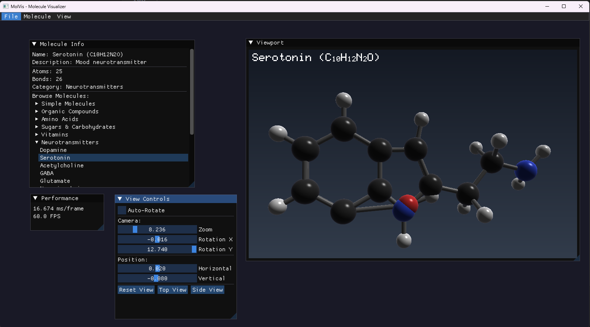

# 🧬 Molecule Visualizer (MolVis)

**GPU-Accelerated Molecular Visualization for Windows and macOS**

MolVis is a real-time 3D molecular visualization application powered by GPU compute shaders and Dear ImGui. It renders beautiful ball-and-stick molecular models with realistic atomic colors, metallic shading, and interactive controls.

- **Windows**: NVIDIA CUDA + DirectX 11
- **macOS**: Apple Metal + SDL2



## ✨ Features

- **Real-time GPU Rendering** — CUDA-powered parallel ray-sphere intersection for smooth performance
- **Dear ImGui Interface** — Modern, responsive GUI with dockable panels
- **301 Molecule Library** — From simple gases to exotic structures like Buckminsterfullerene (C₆₀), including skincare ingredients
- **17 Categories** — Commercial pharmaceuticals, controlled substances, amino acids, sugars, skincare acids, exotic structures, and more
- **CPK Color Convention** — Industry-standard atomic coloring (Carbon=gray, Oxygen=red, Nitrogen=blue, etc.)
- **Ball-and-Stick Models** — Clear visualization of molecular structure with single, double, and triple bonds
- **Interactive Controls** — Rotation speed, direction, position offset, zoom—all from the GUI
- **Metallic Shading** — Specular highlights and realistic lighting for depth perception

## 🖥️ Interface

### Panels

| Panel | Description |
|-------|-------------|
| **Molecule Selector** | Browse 301 molecules by category or search by name (coming soon) |
| **Molecule Viewport** | Interactive 3D model of the selected molecule |
| **View Controls** | Adjust rotation speed, direction, and position offset |
| **Performance** | Real-time FPS and GPU statistics |

### Categories

- **Simple Molecules** (H₂O, CO₂, NH₃...)
- **Organic Compounds** (Benzene, Ethanol, Caffeine...)
- **Amino Acids** (all 20 standard + Hydroxyproline)
- **Nucleobases** (DNA/RNA bases)
- **Sugars & Carbohydrates** (Glucose, Fructose, Ribose...)
- **Lipids & Fatty Acids** (Oleic, Palmitic, Linoleic...)
- **Vitamins** (A, B complex, C, D, E, K)
- **Neurotransmitters** (Dopamine, Serotonin, GABA, Acetylcholine...)
- **Hormones** (Testosterone, Estradiol, Cortisol...)
- **Pharmaceuticals** (Aspirin, Ibuprofen, Warfarin, Lisinopril...)
- **Controlled Substances** (Heroin, Cocaine, LSD, MDMA, Ketamine...)
- **Household Chemicals** (NaOH, NaCl, Bleach, MSG...)
- **Acids** (Acetic, Sulfuric, Glycolic, Salicylic, Citric...)
  - **Skincare Acids** ⭐
    - AHA Acids (Glycolic, Lactic, Citric, Malic, Tartaric)
    - BHA Acids (Salicylic)
- **Metal Compounds** (Ferrocene, Cisplatin, Rust...)
- **Plastics & Polymers** (PET, Polystyrene, Nylon-6...)
- **Energy Molecules** (ATP, ADP, NADH...)
- **Exotic Structures** (C₆₀, Cubane, Catenanes, Molecular Knots...)

## 🛠️ Requirements

### Windows
- **OS**: Windows 10/11
- **GPU**: NVIDIA GPU with CUDA support (Compute Capability 5.0+)
- **CUDA Toolkit**: 12.0 or newer
- **Compiler**: Visual Studio 2019/2022/2025 with C++ workload

### macOS
- **OS**: macOS 11.0 (Big Sur) or newer
- **Hardware**: Any Mac with Metal support (Intel or Apple Silicon)
- **Build Tools**: Xcode Command Line Tools
- **Dependencies**: CMake, SDL2 (via Homebrew)

## 🚀 Building

### Windows (CUDA + DirectX 11)

```powershell
# Option 1: Use build script (recommended)
.\build.bat

# Option 2: Manual build
nmake
```

### macOS (Metal + SDL2)

```bash
# 1. Install Xcode Command Line Tools (if not already installed)
xcode-select --install

# 2. Accept Xcode license and download Metal toolchain (first time only)
sudo xcodebuild -license accept
xcodebuild -downloadComponent MetalToolchain
xcodebuild -runFirstLaunch

# 3. Install dependencies via Homebrew
brew install cmake sdl2

# 4. Build
./build_mac.sh

# 5. Run
open build_mac/bin/MolVis.app
```

**Troubleshooting macOS Build:**
- If you see "metal compiler not found", run `xcodebuild -downloadComponent MetalToolchain`
- If CMake can't find SDL2, ensure Homebrew is in your PATH: `eval "$(/opt/homebrew/bin/brew shellenv)"`
- For Apple Silicon Macs, Homebrew installs to `/opt/homebrew`. For Intel Macs, it's `/usr/local`

## 🧪 Supported Elements

18 elements with CPK coloring:

| Element | Color | Element | Color |
|---------|-------|---------|-------|
| Hydrogen (H) | White | Sodium (Na) | Purple |
| Carbon (C) | Dark Gray | Silicon (Si) | Tan |
| Nitrogen (N) | Blue | Boron (B) | Salmon |
| Oxygen (O) | Red | Iron (Fe) | Orange |
| Phosphorus (P) | Orange | Copper (Cu) | Copper |
| Sulfur (S) | Yellow | Aluminum (Al) | Silver |
| Chlorine (Cl) | Green | Titanium (Ti) | Gray |
| Bromine (Br) | Dark Red | Platinum (Pt) | Silver |
| Fluorine (F) | Light Green | Iodine (I) | Purple |

## 📁 Project Structure

```
MolVis/
├── src/
│   ├── main_windows.cpp      # Windows entry point (Win32 + DX11)
│   ├── main_mac.mm           # macOS entry point (SDL2 + Metal)
│   ├── renderer/
│   │   ├── cuda_renderer.h   # Windows renderer interface
│   │   ├── cuda_renderer.cu  # CUDA ray-tracing kernels
│   │   ├── metal_renderer.h  # macOS renderer interface
│   │   ├── metal_renderer.mm # Metal implementation
│   │   ├── renderer_interface.h  # Platform-agnostic interface
│   │   └── shaders/
│   │       └── MoleculeShaders.metal  # Metal compute shaders
│   └── molecule/
│       ├── molecule_types.h  # Platform-agnostic data structures
│       ├── molecule_db.h     # Molecule database API
│       └── molecule_db.cpp   # 249 molecule definitions
├── platform/
│   ├── windows/              # Windows-specific files
│   └── macos/
│       └── Info.plist        # macOS app bundle info
├── third_party/
│   └── imgui/                # Dear ImGui (all backends)
├── CMakeLists.txt            # Cross-platform build (CMake)
├── Makefile                  # Windows build (nmake)
├── build.bat                 # Windows build script
└── build_mac.sh              # macOS build script
```

## 📄 License

MIT License — see [LICENSE](LICENSE) for details.

## 🙏 Acknowledgments

- **CPK coloring** — Corey, Pauling, and Koltun convention
- **Dear ImGui** — Omar Cornut's immediate-mode GUI
- **NVIDIA CUDA** — GPU computing platform

---

Made with 💜 CUDA, Metal, and Claude Opus 4.5
